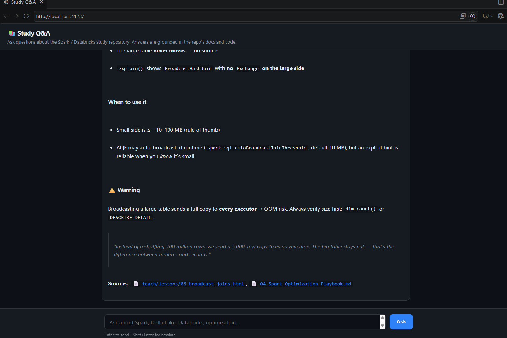

# Databricks & Spark — Study Guide

A self-contained study vault for **Databricks** and **PySpark**. Built to be read in [Obsidian](https://obsidian.md) and version-controlled on GitHub. All cross-links are standard relative Markdown links, so they render in both.

> If you prefer Obsidian wikilinks, you can convert `[text](01-file.md)` → `[[01-file]]` with a find-and-replace, but it isn't necessary.

## What's in this repo

This is more than a pile of notes — it's a small study platform with four working pieces:

| Feature | What it is | Where | Try it |
|---|---|---|---|
| 📚 **Study vault** | 19 cross-linked Markdown notes — mental models, optimization playbook, Delta deep-dive, error playbook, drills, and a self-assessment rubric | `01`–`19` `*.md` | Open in Obsidian or read on GitHub |
| 🧪 **Hands-on notebooks** | Runnable PySpark labs in two tracks: *Databricks* (import to Free Edition) and *local* (jupytext). Includes deliberately **broken/slow notebooks** you fix against a 25-min timer, plus their solutions | `notebooks/` | `mise run db:import` or open locally |
| 🎓 **Guided lesson tool** | A self-paced teaching system: 19 interactive HTML lessons with in-browser quizzes, git-tracked progress (⬜/🟡/✅), and resume-on-any-machine via `mise run teach:*` | `teach/`, `scripts/teach.py` | `mise run teach:next` |
| 💬 **Study Q&A web app** | A local LLM **chat UI built on the GitHub Copilot SDK** that answers questions grounded in *this repo's* docs and code, with clickable file citations | `webapp/` | `mise run webapp` → <http://localhost:4173> |

All four are wired together with [`mise`](https://mise.jdx.dev) tasks and a local Python ([uv](https://docs.astral.sh/uv/)) + Node ([pnpm](https://pnpm.io)) toolchain, version-matched to **Databricks Serverless Environment v4** (Python 3.12.3, JDK 17, PySpark 3.5.x).

## The study focus in one paragraph

This guide centers on **Databricks Free Edition** (serverless) and **PySpark**, working **open-book** with docs, API references, and the in-product AI assistant **Genie Code**. The material is organized around two core skill areas:

1. **Spark Optimization.** Take a *running but slow* PySpark app, find the **4–6** things to improve, fix them, and *explain why*.
2. **Python feature work.** Add a feature to an existing Python product; read and reason about code you didn't write.

It builds four skills: **Computational Thinking, Code Stewardship, AI Stewardship, Resilience.** The single most valuable habit while practicing is **thinking out loud.**

## How to use this vault

Three layers, drilled in order:

1. **Reading notes** (01–04, 07, 12, 14, 15) — mental models you need to *speak* fluently.
2. **Hands-on labs** (05, 06, 10–11, 16–17 + `notebooks/`) — runnable code on Databricks **and** locally.
3. **Drills + self-assessment** (08, 09, 13, 18, 19) — rehearsal under the clock.

| # | Note | Type | Use it for |
|---|------|------|-----------|
| 01 | [Interview Overview & Strategy](01-Interview-Overview-and-Strategy.md) | Read | What's graded, the "vibe", time management, talking out loud |
| 02 | [Free Edition / Serverless Gotchas](02-Databricks-Free-Edition-Serverless-Gotchas.md) | Read + Setup | The constraints that trip people up live (cache, Spark UI, RDD) |
| 03 | [Spark Mental Models](03-Spark-Mental-Models.md) | Read | "Explain how your code executes and scales" |
| 04 | [Spark Optimization Playbook](04-Spark-Optimization-Playbook.md) | Read + Code | The 6 levers, before/after, business translation |
| 05 | [Spark Optimization Challenge](05-Spark-Optimization-Challenge.md) | Hands-on (timed) | A full slow app to fix; the original 25-min drill |
| 06 | [Python Feature-Dev Challenge](06-Python-Feature-Dev-Challenge.md) | Hands-on (timed) | Read existing code, add features, reference solutions |
| 07 | [AI Stewardship — Genie Code](07-AI-Stewardship-Genie-Code.md) | Read + Drill | Prompt well, catch hallucinations, audit checklist |
| 08 | [Mock Q&A & Talking Points](08-Mock-QA-and-Talking-Points.md) | Drill | Rapid-fire questions with answers |
| 09 | [PySpark Cheatsheet](09-Cheatsheet-PySpark.md) | Reference | Snippets you'll actually type |
| 10 | [Hands-On Lab Index](10-Hands-On-Lab-Index.md) | Nav | All the runnable notebooks |
| 11 | [Local Dev Setup (mise + uv + Databricks CLI)](11-Local-PySpark-Setup-uv.md) | Setup | `mise install` → daily local practice |
| 12 | [Delta Lake Deep Dive](12-Delta-Lake-Deep-Dive.md) | Read | MERGE / SCD2 / OPTIMIZE / time travel / Liquid Clustering |
| 13 | [Spark SQL Drills](13-Spark-SQL-Drills.md) | Drill | 10 SQL warm-ups, SQL + DataFrame answers |
| 14 | [Data Engineering Patterns](14-Data-Engineering-Patterns.md) | Read | Medallion, idempotent loads, CDC, SCD, watermarks |
| 15 | [Common Spark Errors & Debugging](15-Common-Spark-Errors-Debug.md) | Read | 12-error playbook + the 4-step recovery script |
| 16 | [Additional Spark Challenges](16-Additional-Spark-Challenges.md) | Hands-on (timed) | 2 more slow apps — skew/window + incremental MERGE |
| 17 | [Additional Python Challenges](17-Additional-Python-Challenges.md) | Hands-on (timed) | Stream pipeline + retry/backoff decorator |
| 18 | [Timed Speed Drills](18-Timed-Speed-Drills.md) | Drill | 5/10/15-min warm-ups for syntax + scenarios |
| 19 | [Self-Assessment Rubric](19-Self-Assessment-Rubric.md) | Score yourself | Grade your dress rehearsal |

## Runnable notebooks

Two parallel tracks (full index in [10](10-Hands-On-Lab-Index.md)):

```
notebooks/
├── databricks/                    # .py with `# COMMAND ----------` markers — import to Free Edition
│   ├── 01_environment_check.py
│   ├── 02_spark_fundamentals.py
│   ├── 03_optimization_challenge_start.py   ← the 25-min timed lab
│   ├── 04_optimization_challenge_solution.py
│   ├── 05_broadcast_and_skew.py
│   ├── 06_delta_merge_scd.py
│   ├── 07_window_functions.py
│   └── 08_dq_engine_python.py               ← the Python 25-min timed lab
└── local/                         # jupytext percent format — open in VS Code or convert with `mise run to-ipynb`
    ├── 01_local_warmup.py
    ├── 02_local_optimization.py
    └── 03_local_dq_engine.py
```

## Getting started in 5 minutes

```bash
# Tools (one-time per machine)
curl https://mise.run | sh                   # install mise
echo 'eval "$(mise activate bash)"' >> ~/.bashrc && exec bash

# Project (one-time per clone)
git clone <this repo> && cd spark-databricks-study
mise trust && mise install                    # installs Python 3.12, JDK 17, uv, databricks-cli
mise run setup                                # uv sync — installs PySpark, Delta, Jupyter
mise run smoke                                # verify local PySpark works

# Databricks side (when you're ready)
mise run init-env                             # interactive .env setup (host, profile, dest)
mise run db:login                             # OAuth into Free Edition
mise run db:import                            # push notebooks/databricks/ into your workspace
```

Versions match **Databricks Serverless Environment v4** (Python 3.12.3, JDK 17, PySpark 3.5.x). See [11](11-Local-PySpark-Setup-uv.md).

## Guided study — interactive lessons

A step-by-step teaching system lives in `teach/`. Progress is tracked via git-committed learning records so you can stop on one machine and resume on another.

```bash
# First time on a machine
git clone <this repo> && cd spark-databricks-study
mise trust && mise install && mise run setup  # same as above

# Start (or resume) studying
mise run teach:status          # see all 19 lessons: ⬜ not started / 🟡 started / ✅ complete
mise run teach:next            # open the next incomplete lesson in your browser
```

```bash
# After finishing a lesson
mise run teach:done 01         # writes a learning record marking lesson 01 complete
git add teach/ && git commit -m "complete lesson 01" && git push

# Picking up on a different machine
git pull
mise run teach:status          # see where you left off
mise run teach:next            # jump back in
```

```bash
# Other commands
mise run teach:lesson 06       # (re)open any specific lesson by number
mise run teach:restart 01      # reset a lesson to not-started so you can replay it
```

The 19 lessons follow the two core skill areas: Spark mental models + optimization first, then Python feature-dev and AI stewardship. See [`teach/CURRICULUM.md`](teach/CURRICULUM.md) for the full map and a priority list if study time is short.

## Study Q&A web app — chat with this repo (GitHub Copilot SDK)

A small local web app (`webapp/`) that lets you **ask questions in plain English and get answers grounded in this repository's own notes, code, and lessons** — every answer comes with clickable file citations back to the source.



What makes it notable:

- **Built on the [GitHub Copilot SDK](https://github.com/github/copilot-sdk).** It drives your already-authenticated Copilot CLI — **no separate API key** needed.
- **Repo-grounded answers.** The assistant reads and searches the repo (`STUDY_REPO_ROOT`) to answer, so responses cite the actual study guides, notebooks, and lessons rather than generic web knowledge.
- **Read-only by design.** A custom `onPermissionRequest` handler approves only read operations — the assistant can't modify, create, delete files, or run shell commands.
- **Clickable 📄 citations.** File references in an answer become links; clicking one opens the file locally (works on WSL2, macOS, and Linux).
- **Streaming Markdown UI.** Server-Sent Events stream the response; answers render with GFM tables/headings/lists (`marked` + `DOMPurify`). No build step.
- **Conversation continuity.** Follow-up questions reuse the session so context carries over.

```bash
mise run webapp          # installs deps and starts the server
# then open http://localhost:4173
```

Configurable via env vars (`PORT`, `COPILOT_MODEL`, `STUDY_REPO_ROOT`, `COPILOT_CLI_PATH`). Requires Node 20+ and an authenticated Copilot CLI on your `PATH`. See [`webapp/README.md`](webapp/README.md) for architecture details.

## Suggested 5–7 day plan

- **Day 1 — Orient.** Read 01 and 02. Run `mise install && mise run setup && mise run smoke`. Sign up for Free Edition. Open `notebooks/databricks/01_environment_check.py` in the workspace.
- **Day 2 — Internals.** Read 03. Run `notebooks/local/01_local_warmup.py`. Whiteboard *transformation vs action*, *narrow vs wide*, *jobs→stages→tasks*.
- **Day 3 — Levers + Delta.** Read 04 and 12. Run `notebooks/databricks/05_broadcast_and_skew.py` and `06_delta_merge_scd.py`.
- **Day 4 — Spark hands-on.** Do 05 with a 25-minute timer (`notebooks/databricks/03_…_start.py`). Don't peek at the solution until you've found at least 4 issues. Optionally do one of the [16](16-Additional-Spark-Challenges.md) follow-ups.
- **Day 5 — Python hands-on.** Do 06 with a 25-minute timer. Optionally do one [17](17-Additional-Python-Challenges.md) follow-up.
- **Day 6 — AI + drills.** Read 07, run the hallucination drill. Then 08 and 13 and 18 rapid-fire out loud.
- **Day 7 — Review.** Redo 05 and 06 end-to-end. Review with [19](19-Self-Assessment-Rubric.md) and score yourself.

## The one rule that beats everything

> **Narrate.** Reasoning out loud — catching yourself, recovering, and explaining trade-offs — cements understanding far better than working in silence. Practice thinking in the open.


## Skill Areas Overview

This guide mirrors the day-to-day work of solving realistic data problems with code
on the Databricks platform. The emphasis is on first-principles thinking and an
AI-builder mindset rather than memorized syntax.

### The approach
- Work hands-on, treating each exercise as a real customer problem to solve.
- Open-book: docs and the in-product Databricks Assistant are fair game.
- Think out loud — narrate your mental model and trade-offs constantly.
- Customer-translate: explain your code in business terms a stakeholder would follow.

### Setup & environment
- Runs on Databricks Free Edition (serverless).
- Sign up for a Free Edition account and get comfortable with notebooks, running
  Python/SQL cells, and the built-in Assistant.
- Keep code clean, structured, commented, and reproducible.
- Lean on the built-in Databricks Assistant; API docs are fine.
- Use only public or self-generated data — never sensitive/proprietary data.

### The two focus areas

**Python feature work**
- Digest and understand an unfamiliar codebase, debug as needed, add a feature.
- The Assistant is allowed, but *you are the pilot* — audit its output and catch
  hallucinations or inefficiencies.
- Be ready to discuss how the code executes and scales.

**Spark optimization**
- Take a running but poorly performing Spark application.
- Find and fix performance issues and explain the reasoning behind each.
- Ask clarifying questions; be ready to discuss alternatives.

### How to study
- Brush up on Python and your common tooling.
- Sign up for Databricks Free Edition and experiment with the Assistant.
- Practice: spend ~50–60 min on a small coding exercise in a Databricks notebook
  on a dataset of your choice, using the Assistant.

### Skills you'll build
- **Computational Thinking** — decompose a messy problem into a clean sequence of transforms.
- **Code Stewardship** — write working code *and* explain what it does under the hood;
  read and reason about code you didn't write.
- **AI Stewardship** — prompt the Assistant well, evaluate its output, catch when it's wrong.
- **Resilience** — when you hit a bug, navigate the unknown calmly and methodically.

### Final tips
- Don't drown in syntax — if you're stuck >2 min on an import or a comma, move on and
  come back. This is about architecture, not typing speed.
- Own the final answer — whether hand-written or Assistant-generated, be ready to defend
  every line.